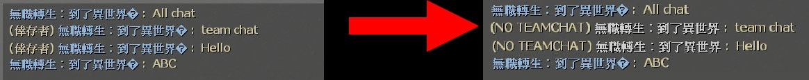

# Description | 內容
Print team chat message to all clients on the server

* Apply to | 適用於
    ```
    Any Source Game
    ```

* Image | 圖示
	* No team chat ( 團隊聊天 變成 公開聊天)
	<br/>

* Require | 必要安裝
	1. [smlib](https://github.com/fbef0102/L4D1_2-Plugins/releases/tag/smlib-Colors)

* <details><summary>ConVar | 指令</summary>

	* cfg/sourcemod/lfd_noTeamSay.cfg
		```php
        // Messages starting with this will be ignored, separate by , symbol
        noteamsay_ignorelist "!,/,@"
		```
</details>

* <details><summary>Changelog | 版本日誌</summary>

	* v1.0h (2025-12-2)
		* To prevent conflict with other plugins, now this plugin does not block the team chat message
		* Print team chat message to all clients on the server
		* Require smlib

	* v2.4 (2023-5-20)
		* Fixed Error

	* v2.3 (2023-5-13)
		* Optimize Code

	* v2.2
        * Remake Code
        * Fixed compatibility with plugin "sm_regexfilter" 1.3 by Twilight Suzuka, HarryPotter

	* v1.0
		* [Original plugin by bullet28](https://forums.alliedmods.net/showthread.php?p=2691314)
</details>

- - - -
# 中文說明
玩家輸入的團隊聊天訊息會傳送給伺服器內所有人看

* 原理
	* 不管在哪一個頻道說話，全部的人都能看到

* 用意在哪?
    * 不說悄悄話
    * 比較方便，全體玩家打屁哈啦聊天

* <details><summary>指令中文介紹 (點我展開)</summary>

	* cfg/sourcemod/lfd_noTeamSay.cfg
		```php
        // 用這些符號開頭的文字會被忽略，用逗號區分
        noteamsay_ignorelist "!,/,@"
		```
</details>