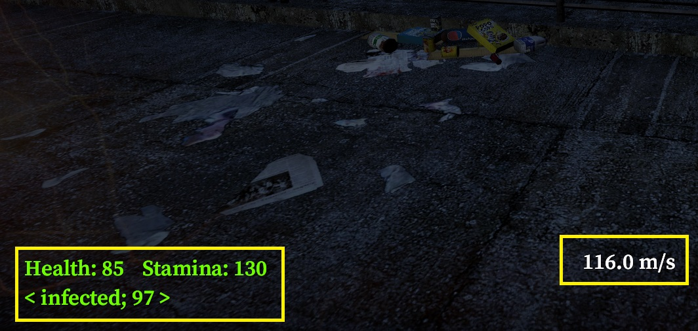
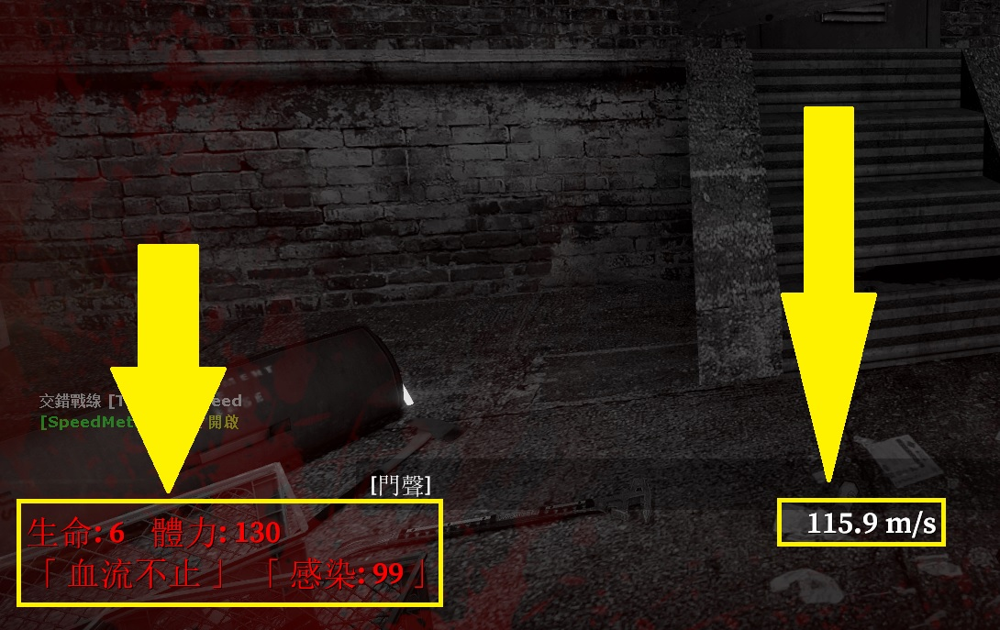

# Description | 內容
Display health, stamina, speed, infected status, ammo on hud

* Image | 圖示
    <br/>

* Apply to | 適用於
    ```
    No More Room in Hell
    ```
    
* <details><summary>How does it work?</summary>

    * Display health, stamina, infected status, weapon clip/ammo on hud
    * Type ```!speed``` to display your speed on hud
</details>

* Require | 必要安裝
<br/>None

* <details><summary>ConVar | 指令</summary>

    * cfg/sourcemod/nmrih_HUD.cfg
        ```php
        // 1=Display health, stamina, infected status in the HUD. 0=Off
        nmrih_HUD_display_health "1"

        // 1=Display speed meter in the HUD. 0=Off
        nmrih_HUD_display_speed "1"

        // 1=Always display weapon clip/ammo in the HUD. 0=Show only clip number or ammo number changes, -1=Off
        nmrih_HUD_display_ammo "0"

        // 1 = Active the speed hud for client by default, 0 = Disable the speed hud for client by default
        nmrih_HUD_speed_default "0"
        ```
</details>

* <details><summary>Command | 命令</summary>

    * **Enable/Disable Speed Hud**
        ```php
        sm_speed
        ```
</details>

* <details><summary>Translation Support | 支援翻譯</summary>

    ```
    English
    繁體中文
    简体中文
    ```
</details>

* <details><summary>Changelog | 版本日誌</summary>

    * v1.1h (2025-2-18)
        * Add weapon clip/ammo hud

    * v1.0h (2024-12-23)
        * Update translation
        * Improve code

    * Original & Credit
        * [clague](https://github.com/clague/plugin-source/blob/master/addons/sourcemod/scripting/HUD.sp)
        * [Grey83](https://forums.alliedmods.net/showthread.php?t=261699)
</details>

- - - -
# 中文說明
顯示HUD在玩家的螢幕上: 血量、體力、感染狀態、速度、武器彈藥...

* 適用於
    ```
    地獄已滿
    ```

* 圖示
    <br/>

* 原理
    * 顯示HUD在玩家的螢幕上: 血量、體力、感染狀態、武器彈夾與備彈
    * 輸入```!speed```顯示速度HUD

* <details><summary>指令中文介紹 (點我展開)</summary>

    * cfg/sourcemod/nmrih_HUD.cfg
        ```php
        // 1=顯示HUD: 血量、體力、感染狀態. 0=不顯示
        nmrih_HUD_display_health "1"

        // 1=顯示HUD: 速度. 0=不顯示
        nmrih_HUD_display_speed "1"

        // 1=永遠顯示HUD: 武器彈夾與備彈. 0=彈夾數字或備彈數字發生變化時才顯示, -1=不顯示
        nmrih_HUD_display_ammo "0"

        // 1 = 自動幫玩家打開速度Hud, 0 = 不自動打開速度Hud，玩家需要手動輸入開啟
        nmrih_HUD_speed_default "0"
        ```
</details>

* <details><summary>命令中文介紹 (點我展開)</summary>

    * **開/關 顯示速度HUD**
        ```php
        sm_speed
        ```
</details>


