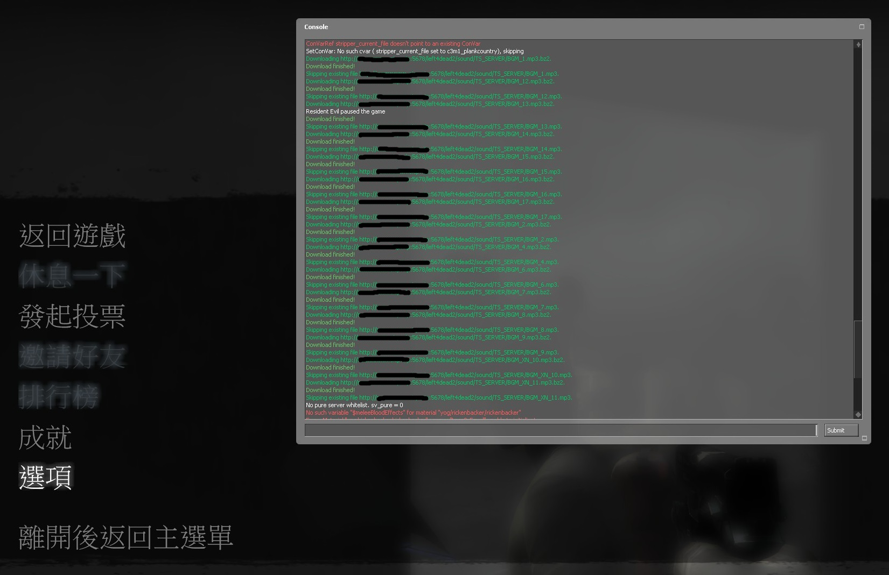
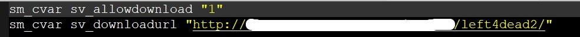
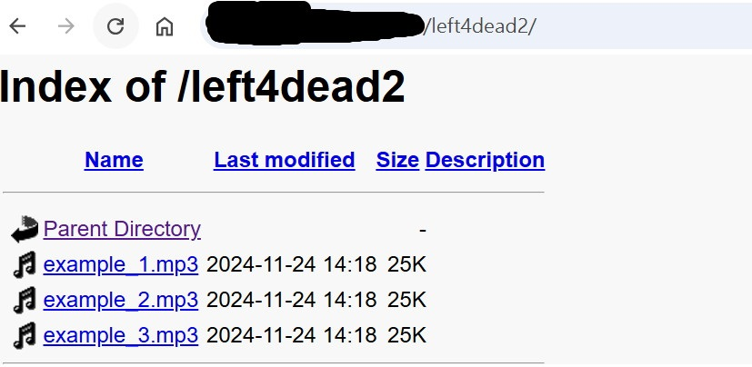
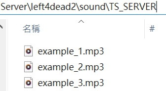
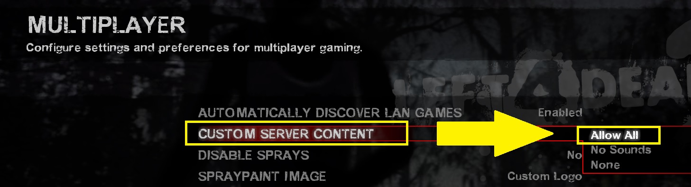
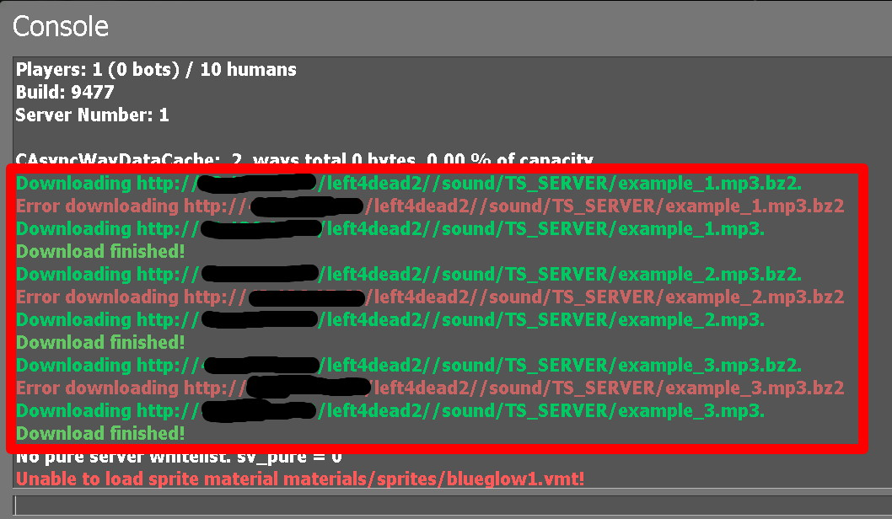
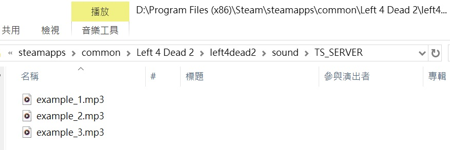
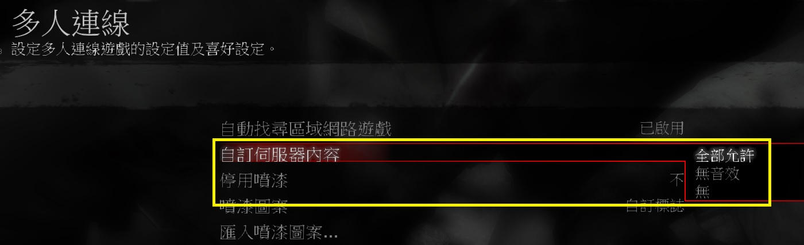

# Description | 內容
SM File/Folder Downloader and Precacher
(Client will download custom files when connecting server)

* Apply to | 適用於
	```
	Any Source Game
	```

* Image | 圖示
	* client connecting server and downloading custom files (玩家連線伺服器時下載自製的檔案)
	<br/>

* Require | 必要安裝
	1. 🟥 Prepare [your content-server for FastDL](https://developer.valvesoftware.com/wiki/FastDL), othersie this plugin will not work 
		* 🟥 需[自備網空且支援FastDL](https://developer.valvesoftware.com/wiki/Zh/FastDL)，否則此插件會無效 (不知道什麼是FastDL請自行Google)

* <details><summary>Support | 支援插件</summary>

	1. (L4D1/2) [l4d_force_client_custom_download](https://github.com/fbef0102/Game-Private_Plugin/tree/main/L4D_%E6%8F%92%E4%BB%B6/Player_%E7%8E%A9%E5%AE%B6/l4d_force_client_custom_download): Force player to download your server's custom content
		* (L4D1/2) 強制玩家打開設置下載伺服器自製的檔案

	2. (L4D1/2) [l4d_fastdl_delay_downloader](https://github.com/fbef0102/L4D1_2-Plugins/tree/master/l4d_fastdl_delay_downloader): Downloading fastdl custom files only when map change/transition
		* (L4D1/2) 只有在換圖或過關時，才讓玩家下載Fastdl自製的檔案
</details>

* <details><summary>ConVar | 指令</summary>

	* cfg/sourcemod/sm_downloader.cfg
		```php
		// 0=Plugin off, 1=Plugin on.
		sm_downloader_enabled "1"

		// If 1, Enable normal downloader file (Download & Precache)
		sm_downloader_normal_enable "0"

		// If 1, Enable simple downloader file. (Download Only No Precache)
		sm_downloader_simple_enable "1"

		// (Download & Precache) Full path of the normal downloader configuration to load. 
		// IE: configs/sm_downloader/downloads_normal.ini
		sm_downloader_normal_config "configs/sm_downloader/downloads_normal.ini"

		// (Download Only No Precache) Full path of the simple downloader configuration to load. 
		// IE: configs/sm_downloader/downloads_simple.ini
		sm_downloader_simple_config "configs/sm_downloader/downloads_simple.ini"
		```
</details>

* <details><summary>Data Example</summary>

	* [configs/sm_downloader/downloads_normal.ini](addons/sourcemod/configs/sm_downloader/downloads_normal.ini): Normal downloader configuration
		* Download and Precache Files
		* [View Example How to Write](addons/sourcemod/configs/sm_downloader/downloads_normal_example(範例).ini)

	* [configs/sm_downloader/downloads_simple.ini](addons/sourcemod/configs/sm_downloader/downloads_simple.ini): Simple downloader configuration 
		* Download only 
		* No Precache
		* [View Example How to Write](addons/sourcemod/configs/sm_downloader/downloads_simple_example(範例).ini) to view example

	* 🟥 If you don't know which file should use, just enable and use **downloads_simple.ini**
</details>

* <details><summary>How to make the client download custom files</summary>

	> Take L4D1, L4D2 for example
	1. Preparation of custom files
		* Prepare your custom files
		* Prepare [your content-server for FastDL](https://developer.valvesoftware.com/wiki/FastDL), if you don't know what "FastDL" is, please google it
		* Allow HTTP (Port 80 needed to be open), not HTTPS

	2. Setup server to work with downloadable content
		* Write down in your ```cfg/server.cfg```:
			* If you are L4D1
				```php
				sm_cvar sv_allowdownload "1"
				sm_cvar sv_downloadurl "http://your-content-server.com/left4dead/"
				```
			* If you are L4D2
				```php
				sm_cvar sv_allowdownload "1"
				sm_cvar sv_downloadurl "http://your-content-server.com/left4dead2/"	
				```
		<br/>

	3. Uploading files to server.
		* Upload all your custom files to content-server
			* If you are L4D1, ```your-content-server.com/left4dead/```
			* If you are L4D2, ```your-content-server.com/left4dead2/```
		<br/>

		* Upload all your custom files to your dedicated server
			* If you are L4D1, ```Left 4 Dead Dedicated Server/left4dead```
			* If you are L4D2, ```Left 4 Dead 2 Dedicated Server/left4dead2```
		<br/>

		* Add the path of each files to the downloader configuration 
			* ```addons/sourcemod/configs/sm_downloader/downloads_normal.ini``` Or ```addons/sourcemod/configs/sm_downloader/downloads_simple.ini```
			* The path has to be put relative to the game folder, and with the file extension.

	4. Start the server and test
		* Launch your game, "Options-> Multiplayer -> CUSTOM SERVER CONTENT -> Allow All"
		<br/>
		* Connect to server. 
		* Open console to see if the game is downloading custom files
			* Note: It does not display in l4d1
		<br/>
		* Browse your local game folder, check if files are there, done.
		<br/>

	5. Player would start downloading custom files when connecting to your server
		* 🟥 They must set "Options-> Multiplayer -> CUSTOM SERVER CONTENT -> Allow All", othwerwise they won't download
</details>

* <details><summary>Q&A</summary>

	* Q1: Why it won't download files ?
		* A1: If file is not downloading, try rename logner file name or different folder
			* 🟥 And please ensure no file has space or special characters like "long dash" (–) or so.
			* 🟥 Valve Block path: addons, scripts
			* 🟥 Valve Block file format: .vpk

	* Q2: Download custom sounds successfully, buy why can't play them in game ?
		* A2: Use .mp3 file if play custom sound, otherwise it may not play at all
			* 🟥 All MP3 files must be encoded in 44100 Hz sample rate 
			* 🟥 128 or 192 Kbit/s
</details>

* <details><summary>Changelog | 版本日誌</summary>

	* v2.2 (2024-11-21)
		* Fix downloads_normal.ini not working

	* v2.1 (2024-10-28)
		* Update cvars
		* Rename downloader configuration file

	* v2.0 (2023-12-6)
		* Fixed not downloading custom files on the first map after server startup 
		
	* v1.9 (2023-9-27)
		* Fixed custom sound not Precache

	* v1.8 (2023-5-4)
		* Fixed custom spray blocked and fail to download

	* v1.7 (2022-11-16)
		* Remake Code
		* Auto-generate cfg

	* Original & Credit
		* [SWAT_88](https://forums.alliedmods.net/showthread.php?t=69005)
</details>

- - - -
# 中文說明
SM 文件下載器 (玩家連線伺服器的時候能下載自製的檔案)

* 原理
	* [什麼是自訂伺服器內容?](https://github.com/fbef0102/Game-Private_Plugin/tree/main/Tutorial_教學區/Chinese_繁體中文/Game#%E4%B8%8B%E8%BC%89%E8%87%AA%E8%A8%82%E4%BC%BA%E6%9C%8D%E5%99%A8%E5%85%A7%E5%AE%B9)
	* 🟥 將你自己的自製檔案(貼圖、音樂、模組等等)準備好，上傳到自己準備的[網空支援Fastdl](https://developer.valvesoftware.com/wiki/Zh/FastDL)，玩家連線的時候會從網空伺服器上下載自製的檔案
		* 不知道什麼是FastDL請自行Google
		* 安裝FastDL教學請自行Google

* <details><summary>指令中文介紹 (點我展開)</summary>

	* cfg/sourcemod/sm_downloader.cfg
		```php
		// 0=關閉插件, 1=啟動插件
		sm_downloader_enabled "1"

		// 為1時，啟用正常版的檔案下載設定文件 (下載並緩存)
		sm_downloader_normal_enable "0"

		//  為1時，啟用簡單版的檔案下載設定文件 (只下載不預緩存)
		sm_downloader_simple_enable "1"

		// (下載並緩存) 設定正常版下載的文件檔案路徑
		// IE: configs/sm_downloader/downloads_normal.ini
		sm_downloader_normal_config "configs/sm_downloader/downloads_normal.ini"

		// (只下載不預緩存) 設定簡單版下載的文件檔案路徑
		// IE: configs/sm_downloader/downloads_simple.ini
		sm_downloader_simple_config "configs/sm_downloader/downloads_simple.ini"
		```
</details>

* <details><summary>Data設定範例</summary>

	* [configs/sm_downloader/downloads_normal.ini](addons/ourcemod/configs/sm_downloader/downloads_normal.ini): 正常版的下載設定文件
		* 下載並緩存文件
		* [查看範例如何寫文件](addons/sourcemod/configs/sm_downloader/downloads_normal_example(範例).ini)

	* [configs/sm_downloader/downloads_simple.ini](addons/sourcemod/configs/sm_downloader/downloads_simple.ini): 簡單版下載設定文件
		* 只下載文件
		* 不會預緩存文件
		* [查看範例如何寫文件](addons/sourcemod/configs/sm_downloader/downloads_simple_example(範例).ini)

	* 🟥 如果你不知道這兩設定文件有捨差別, 建議你一律使用downloads_simple.ini
</details>

* <details><summary>玩家如何下載檔案?</summary>

	> 以L4D1與L4D2為例，其他遊戲自行摸索
	1. 準備你的自製檔案
		* 準備好你的所有自製檔案(貼圖、音樂、模組等等)
		* 文件名
			* 確保沒有文件有空格或特殊字符，如“長破折號”(–) 等。
			* 不能有中文
		* 準備好[你的網空並可以支援FastDL](https://developer.valvesoftware.com/wiki/Zh/FastDL), 不知道什麼是FastDL請自行Google
		* 網空的網站允許HTTP協定 (Port 80 必須打開)，注意不是 HTTPS
		
	2. 設置cfg指定網空
		* 寫入以下內容到cfg/server.cfg
			* 如果你是 L4D1
				```php
				sm_cvar sv_allowdownload "1"
				sm_cvar sv_downloadurl "http://your-content-server.com/left4dead/"
				```
			* 如果你是 L4D2
				```php
				sm_cvar sv_allowdownload "1"
				sm_cvar sv_downloadurl "http://your-content-server.com/left4dead2/"	
				```
		<br/>

	3. 上傳文件到伺服器
		* 所有自製的檔案上傳到網空伺服器。
			* 如果你是 L4D1，```your-content-server.com/left4dead/```
			* 如果你是 L4D2，```your-content-server.com/left4dead2/```
		<br/>

		* 所有自製的檔案複製到您的遊戲伺服器資料夾上。
			* 如果你是 L4D1，```Left 4 Dead Dedicated Server/left4dead```
			* 如果你是 L4D2，```Left 4 Dead 2 Dedicated Server/left4dead2```
		<br/>

		* 將每個檔案的路徑添加到檔案下載設定文件
			* ```addons/sourcemod/configs/sm_downloader/downloads_normal.ini```或```addons/sourcemod/configs/sm_downloader/downloads_simple.ini```。
			* 路徑必須相對於遊戲資料夾，必須要寫上副檔名，不能有中文。
		
	4. 啟動伺服器並測試
		* 打開你的遊戲，"選項->多人連線->自訂伺服器內容->全部允許"
		<br/>
		* 連線到伺服器
		* 打開控制台查看是否下載自製的檔案 (此處圖片顯示正在下載音樂)
			* 部分遊戲譬如L4D1不會顯示這些
		<br/>
		* 打開你的本地遊戲資料夾查看檔案是否已經下載 
		<br/>

	5. 玩家加入伺服器時，會自動下載自製的文件
		* 🟥 玩家必須自己打開"選項->多人連線->自訂伺服器內容->全部允許"，否則玩家不會自動下載
</details>

* <details><summary>Q&A</summary>

	* Q1: 為什麼我將檔案寫入data文件依然無法下載 ?
		* A1: 如果檔案沒有下載，請嘗試重新命名更長的檔案名稱或變更資料夾路徑, 非所有路徑與文件類型都能傳送
			* 🟥 路徑與檔案請不要有空格或是特殊符號
			* 🟥 已確定會被Valve阻擋的路徑有: addons, scripts
			* 🟥 已確定Valve不允許傳送的文件類型有: .vpk

	* Q2: 為什麼音效檔案已下載卻沒有聲音 ?
		* A2: 如要播放自製音效，建議使用 MP3 文件，否則可能根本無法播放
			* 🟥 所有音效文件必須以 44100 Hz 採樣率編碼
			* 🟥 128或 192 Kbit/s 比特率重新編碼
</details>