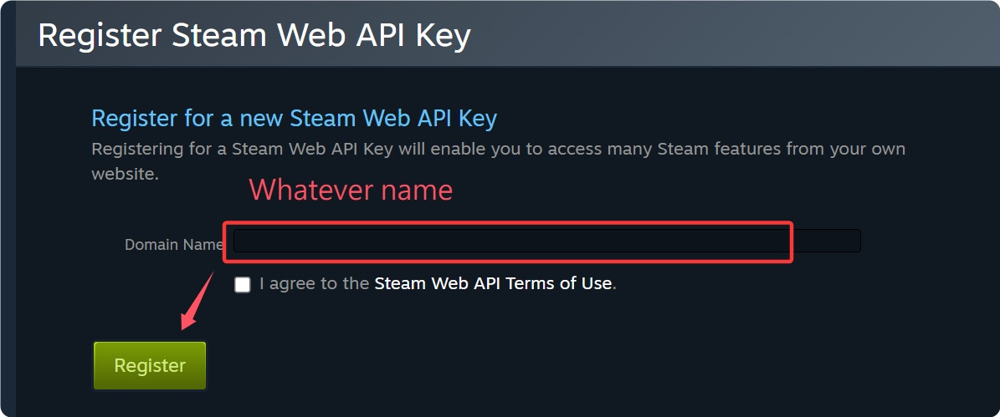
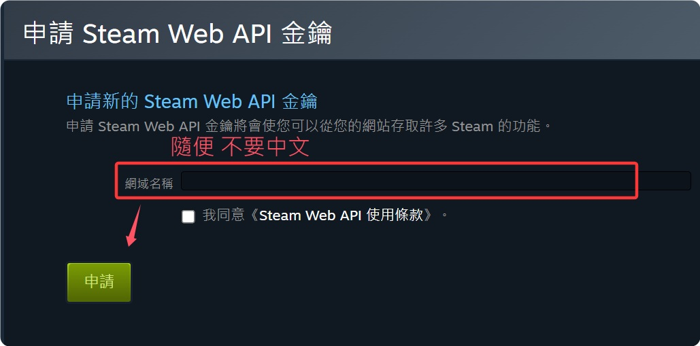

# Description | 內容
Checks for VAC, game, Steam Community, and trade bans on the accounts of connecting clients

* Apply to | 適用於
    ```
    Any Source Game
    ```

* Require | 必要安裝
    1. [Socket](https://github.com/JoinedSenses/sm-ext-socket/releases)
    2. [[INC] Multi Colors](https://github.com/fbef0102/L4D1_2-Plugins/releases/tag/Multi-Colors)

* <details><summary>How does it work?</summary>

    * Run plugin and let server auto-generate ```cfg/sourcemod/vacbans.cfg```
        * -> Register Steam Web API Key: https://steamcommunity.com/dev/apikey
            * 🟥 Do not share your Key
            <br/>
        * -> Write key ```sm_vacbans_apikey xxx``` -> Save and restart server
    * If player has the following record, kick and ban
        * VAC bans
        * Game bans: Bannd by specific game
        * Community: Bannd by steam community
        * Economy: Trade bans
    * Log record in [logs/vacbans.log](logs/vacbans.log)
</details>

* <details><summary>ConVar | 指令</summary>

    * cfg/sourcemod/vacbans.cfg
        ```php
        // Actions to take on detected clients
        // Add up the options from the list:
        // 1:  Log to sourcemod/logs/vacbans.log
        // 2:  Kick
        // 4:  Ban
        // 8:  Display message to admins (ADMFLAG_KICK flag)
        // 16: Display message to all players
        // 31: All
        sm_vacbans_actions "31"

        // The Steam Web API key used by VAC Status Checker
        // https://steamcommunity.com/dev/apikey
        sm_vacbans_apikey "xxxxxxxxxxxxxxxxxxxxxxx"

        // How long in days before re-checking the same client
        sm_vacbans_cachetime "1"

        // The named database config to use for caching
        sm_vacbans_db "storage-local"

        // Enable Steam Community ban detection
        sm_vacbans_detect_community_bans "0"

        // Enable economy (trade) ban detection (0 = disabled, 1 = bans only, 2 = bans and probation)
        sm_vacbans_detect_econ_bans "0"

        // Enable game ban detection
        sm_vacbans_detect_game_bans "0"

        // Enable VAC ban detection
        sm_vacbans_detect_vac_bans "1"

        // Ignore VAC bans older than this many days (0 = disabled)
        sm_vacbans_vac_expire "730"

        // Ignore VAC bans issued before this date (format: YYYY-MM-DD)
        sm_vacbans_vac_ignore_before ""

        // Players with these flags will be ignored (Empty = Everyone, -1: Nobody)
        sm_vacbans_immunity "z"
        ```
</details>

* <details><summary>Command | 命令</summary>

    * **Clears the cache database (Access: ADMFLAG_ROOT)**
        ```php
        sm_vacbans_reset
        ```

    * **Control the whitelist (Access: ADMFLAG_ROOT)**
        ```php
        // add <SteamID 64> - adds a SteamID 64 for the plugin to ignore
        // remove <SteamID 64> - removes a SteamID 64 from the whitelist
        // clear - removes all SteamIDs from the whitelist
        sm_vacbans_whitelist <add|remove|clear> [SteamID 64]
        ```

    * **Lists the bans of connected clients (Access: ADMFLAG_ROOT)**
        ```php
        sm_vacbans_list
        ```
</details>

* Translation Support | 支援翻譯
    ```
    translations/vacbans2.phrases.txt
    ```

* <details><summary>Changelog | 版本日誌</summary>

    * v1.2h (2025-10-5)
        * Remake code, convert code to latest syntax
        * Update cvar
        * Remove SteamWorks, SteamTools, use Socket only

    * Original & Credit
        * [Original plugin by StevoTVR](https://forums.alliedmods.net/showthread.php?t=80942)
</details>

- - - -
# 中文說明
封鎖有 VAC/遊戲封禁/社群封禁/交易封禁 的不良玩家進入伺服器

* 原理
    * 安裝插件後先運行伺服器，之後會自動產生文件: ```cfg/sourcemod/vacbans.cfg```
        * -> 註冊並得到 Steam Web API Key: https://steamcommunity.com/dev/apikey
            * 🟥 不要分享給別人知道，每個Steam帳號只會有一個Key
            <br/>
        * -> 寫下Key ```sm_vacbans_apikey xxx``` -> 儲存並重啟伺服器
    * 當玩家有以下紀錄時，踢出遊戲並封禁
        * VAC
        * 遊戲封禁: 被遊戲廠商黑名單
        * 社群封禁: 被Steam社群區黑名單
        * Economy: 被Steam交易區黑名單
    * 寫紀錄於文件: [logs/vacbans.log](logs/vacbans.log)

* 用意在哪?
    * 不知道VAC是什麼可以自行Google

* <details><summary>指令中文介紹 (點我展開)</summary>

    * cfg/sourcemod/vacbans.cfg
        ```php
        // 對檢測到封禁的玩家採取動作
        // 數字可以相加:
        // 1:  寫紀錄於文件: sourcemod/logs/vacbans.log
        // 2:  踢出遊戲
        // 4:  封禁
        // 8:  顯示玩家的封禁狀態給伺服器內在場的管理員看 (權限: ADMFLAG_KICK)
        // 16: 顯示玩家的封禁狀態給伺服器內所有人看
        // 31: 以上全部
        sm_vacbans_actions "31"

        // 寫下你的Steam Web API key, key不要分享給別人
        // 註冊網站: https://steamcommunity.com/dev/apikey
        sm_vacbans_apikey "xxxxxxxxxxxxxxxxxxxxxxx"

        // 同一位玩家在時間內進入伺服器後不需要再檢測 (時間單位: 天)
        sm_vacbans_cachetime "1"

        // 用來暫時儲存玩家的封禁狀態的本地數據庫名稱 (不建議修改)
        sm_vacbans_db "storage-local"

        // 為1時，檢測玩家是否被社群區黑名單
        sm_vacbans_detect_community_bans "0"

        // 檢測玩家是否被交易區黑名單 (0 = 不檢測, 1 = 只檢測有被封鎖過, 2 = 檢測有被封鎖過＋有被處罰過)
        sm_vacbans_detect_econ_bans "0"

        // 為1時，檢測玩家是否被遊戲廠商黑名單
        sm_vacbans_detect_game_bans "0"

        // 為1時，檢測玩家是否被VAC
        sm_vacbans_detect_vac_bans "1"

        // 被VAC超過此天數的玩家則忽略 (0 = 關閉這項功能)
        sm_vacbans_vac_expire "730"

        // 被VAC超過此日期的玩家則忽略 (格式: YYYY-MM-DD)
        sm_vacbans_vac_ignore_before ""

        // 擁有這些權限的玩家，不會被檢測 (留白 = 任何人都能, -1: 無人)
        sm_vacbans_immunity "z"
        ```
</details>

* <details><summary>命令中文介紹 (點我展開)</summary>

    * **清除暫存數據 (權限: ADMFLAG_ROOT)**
        ```php
        sm_vacbans_reset
        ```

    * **控制白名單列表, 在列表上的玩家不會被檢測 (權限: ADMFLAG_ROOT)**
        ```php
        // add <SteamID 64> - 增加 SteamID 64 到白名單上
        // remove <SteamID> - 白名單上移除SteamID 64
        // clear - 清除白名單
        sm_vacbans_whitelist <add|remove|clear> [SteamID 64]
        ```

    * **查看伺服器內每個玩家的封禁狀態 (權限: ADMFLAG_ROOT)**
        ```php
        sm_vacbans_list
        ```
</details>
